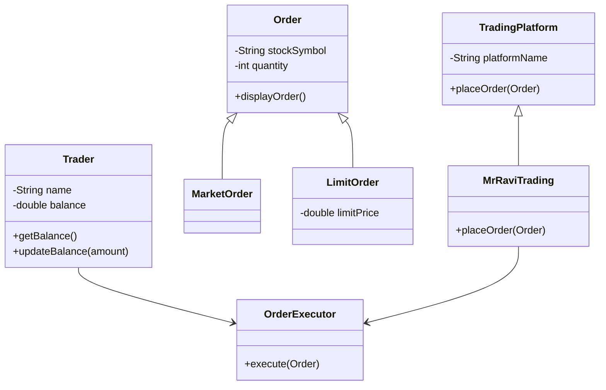

# Q3: What are OOP concepts in Java?

## Explanation

1. **Encapsulation** – Wrapping data + methods in a class.
2. **Inheritance** – Child class inherits from parent class.
3. **Polymorphism** – Same interface, multiple implementations.
4. **Abstraction** – Hiding internal details, exposing only necessary features.

---

## Diagram (Mermaid.js)



---

## Code Example

## Encapsulation

Encapsulation is wrapping **data and methods inside a class** and controlling access via getters/setters.

```java
class Trader {
    private String name;
    private double balance;

    public Trader(String name, double balance) {
        this.name = name;
        this.balance = balance;
    }

    public double getBalance() {
        return balance;
    }

    public void updateBalance(double amount) {
        balance += amount;
    }
}
```
Protects sensitive account info (balance)

Other classes cannot modify balance directly, must use updateBalance().


---
## Inheritance

Inheritance allows different order types to share common properties.

```java
class Order {
    protected String stockSymbol;
    protected int quantity;

    public Order(String stockSymbol, int quantity) {
        this.stockSymbol = stockSymbol;
        this.quantity = quantity;
    }

    public void displayOrder() {
        System.out.println(quantity + " shares of " + stockSymbol);
    }
}

class MarketOrder extends Order {
    public MarketOrder(String stockSymbol, int quantity) {
        super(stockSymbol, quantity);
    }
}

class LimitOrder extends Order {
    private double limitPrice;

    public LimitOrder(String stockSymbol, int quantity, double limitPrice) {
        super(stockSymbol, quantity);
        this.limitPrice = limitPrice;
    }
}

```
MarketOrder and LimitOrder reuse Order properties like stockSymbol and quantity.

---

## Polymorphism

Polymorphism allows different order types to execute differently.

```java
class OrderExecutor {
    public void execute(Order order) {
        if(order instanceof MarketOrder) {
            System.out.println("Executing market order: " + order.quantity + " shares of " + order.stockSymbol);
        } else if(order instanceof LimitOrder) {
            LimitOrder lo = (LimitOrder) order;
            System.out.println("Executing limit order: " + lo.quantity + " shares of " + lo.stockSymbol + " at " + lo.limitPrice);
        }
    }
}


```
Same method execute() behaves differently depending on the order type.

---

## Abstraction

Abstraction hides implementation details and exposes only necessary methods.

```java
abstract class TradingPlatform {
    protected String platformName;

    public TradingPlatform(String name) {
        this.platformName = name;
    }

    public abstract void placeOrder(Order order);
}

class MrRaviTrading extends TradingPlatform {
    public MrRaviTrading(String name) {
        super(name);
    }

    @Override
    public void placeOrder(Order order) {
        System.out.println("Placing order on " + platformName);
        new OrderExecutor().execute(order);
    }
}

```
The system only interacts with placeOrder(); internal logic is hidden.

---

## TEST Example

```java
public class TradingDemo {
    public static void main(String[] args) {
        Trader t1 = new Trader("Alice", 10000);

        MarketOrder mo = new MarketOrder("AAPL", 50);
        LimitOrder lo = new LimitOrder("GOOGL", 10, 2800);

        TradingPlatform platform = new MrRaviTrading("MrRaviTradingApp");
        platform.placeOrder(mo);
        platform.placeOrder(lo);
    }
}
```
Placing order on MrRaviTradingApp
Executing market order: 50 shares of AAPL
Placing order on MrRaviTradingApp
Executing limit order: 10 shares of GOOGL at 2800.0

---