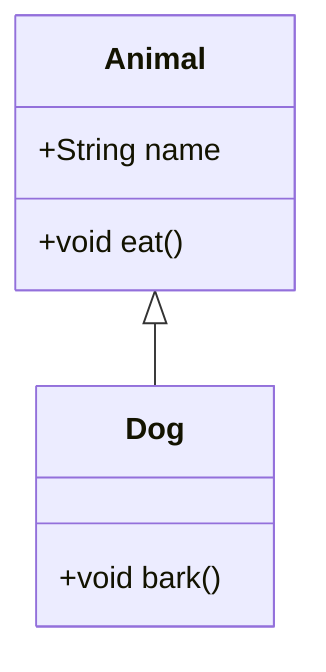

# Q3: What are OOP concepts in Java?

## Explanation

1. **Encapsulation** – Wrapping data + methods in a class.
2. **Inheritance** – Child class inherits from parent class.
3. **Polymorphism** – Same interface, multiple implementations.
4. **Abstraction** – Hiding internal details, exposing only necessary features.

---

## Diagram (Mermaid.js)



---

## Code Example
```java
class Animal {
    void eat() {
        System.out.println("Animal eats");
    }
}

class Dog extends Animal {
    void bark() {
        System.out.println("Dog barks");
    }
}

public class TestOOP {
    public static void main(String[] args) {
        Dog d = new Dog();
        d.eat();
        d.bark();
    }
}

```