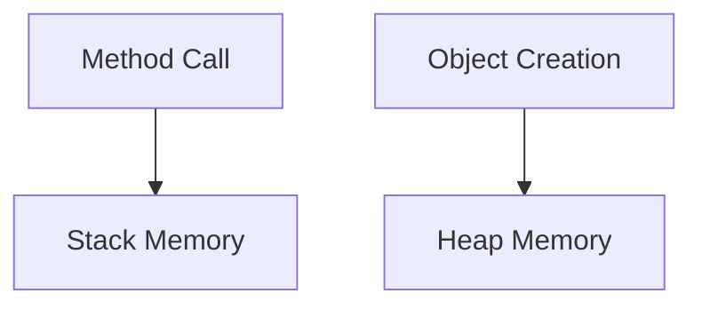

```markdown
# Q5: Difference between Stack and Heap Memory in Java

## Explanation

| Feature | Stack | Heap |
|---------|-------|------|
| Stores | Local variables & function calls | Objects & instance variables |
| Lifetime | Method execution | Until garbage collected |
| Access | Fast | Slower |
| Managed By | JVM automatically | JVM + Garbage Collector |

---

## Diagram (Mermaid.js)



---

## Code Example
```java
class MemoryDemo {
    int number; // stored in heap

    void test() {
        int x = 5; // stored in stack
    }
}
```
